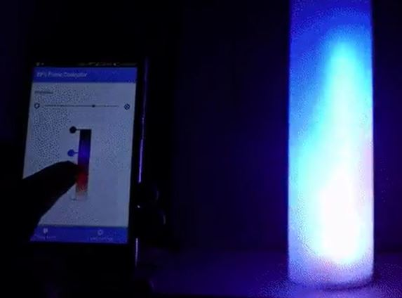
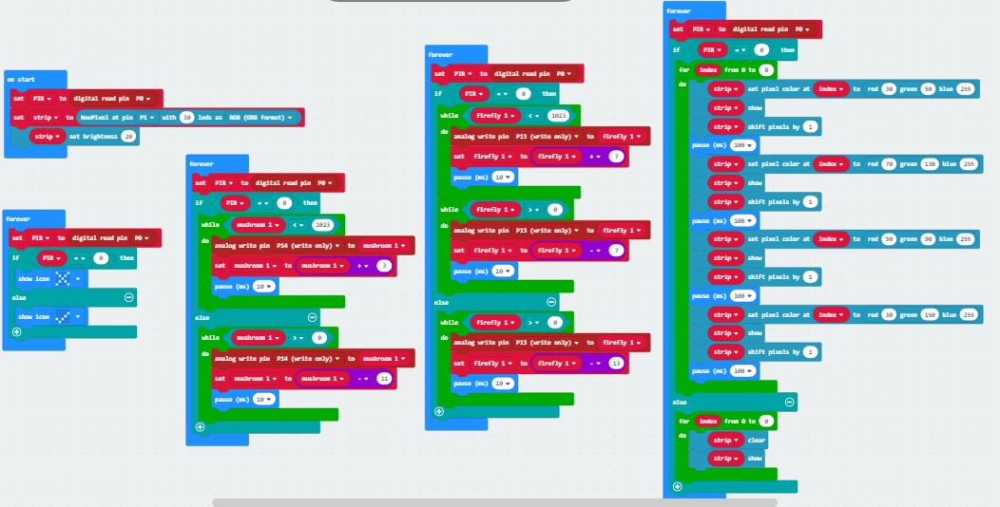
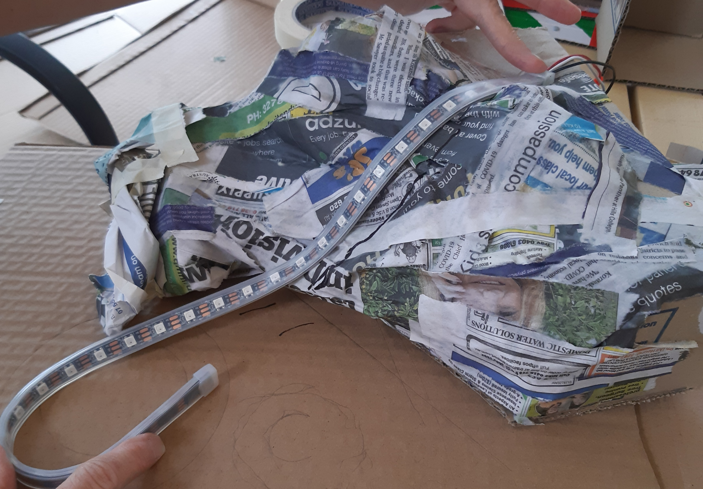

# 1701QCA Making Interaction - Assessment 2 workbook

## Project working title ##
### Still Life ###

## Related projects ##
 
### Related project 1 ###   
Night Light Assisstant

  https://create.arduino.cc/projecthub/gabriele_fugazzi/night-light-assistant-0d9bf0?ref=tag&ref_id=motion%20sensor&offset=4
  

This project is related to mine because it uses the input of a PIR Motion Detector to turn on lights to assist at night.  This function is the same principal to my original concepts however in my final project this was reversed with the lights coming on when there is no movement.

### Related project 2 ###   
Magical Mushrom Lights

https://www.youtube.com/watch?v=D5LjGFkpApw

This project is related to mine because it uses LEDs to make fake mushrooms glow.  I like the way he created the realistic looking mushrooms and hope to use a similar process to make the mushrooms for my project.  However in my environment the mushrooms will be controlled by the input of the motion detector.

### Related project 3 ###   
Jelly Swarm

https://www.tangibleinteraction.com/artworks/jelly-swarm

This project is related to mine because it takes the idea of real world creatures and brings them to a state where we can learn about them by showing how the interaction of people can effect them in the wild.  This same idea is demonstrated in my project as it takes the real life reactions of wild life to an unknown presence.  The paper jellyfish were lit by LEDs which change colour and react with eachother when undisturbed but react differently when effected by humans via a sensor.

### Related project 4 ###   
People Create Space and Time, at the Confluence of their Spacetime New Space and Time is Born

https://www.teamlab.art/w/people_create_space/

This project is related to mine because it uses the same principal of stillness.  In this light display when a person remains still the projection creates a very slow ripple effect which radiates from them across the room creating a peacfull 
experience.  My project also used this continued stillness to have an effect on the environment with the project only coming to life when there is no motion.

### Related project 5 ###   
Play With Fire Over WIFI

https://create.arduino.cc/projecthub/electropeak/play-with-fire-over-wi-fi-esp8266-neopixels-android-app-26c4ad?ref=tag&ref_id=led%20strip&offset=5

This project is related to mine because the effect demonstrated to create the fire uses a NeoPixel LED strip.  I got the idea of including a running water effect from this project as when the light turns blue it reminded me of water. 

### Related project 6 ###   
Flutter of Butterflies Beyond Borders, Ephemeral Life Born from People

https://www.teamlab.art/w/butterflies_ephemerallife_people/

This project is related to mine because when a person stands still it allows for projections of butterflies to grow on them before flying away and navigating the space on their own.  This takes the same idea with the stillness and adds life to it albeit in a non-material form and replicates my idea of stillness welcoming life.

## Other research ##

#### Micro:bit Lesson 3. NeoPixels with Micro:bit ####

https://learn.adafruit.com/micro-bit-lesson-3-neopixels-with-micro-bit/software

This website gave me a good understanding of the basics of programing a NeoPixel with a Microbit to get the desired effect to make the LED strip appear as flowing water.  I was able to experiment with different colour, brightness and movement of the lights.

#### LED Strip Effects ####

https://www.tweaking4all.com/hardware/arduino/adruino-led-strip-effects/

This website gave me lots of examples of what could be done with the NeoPixel strip and what effect could make the best running water however the programing was made for Arduino and couldn't be used with the Microbit.  The videos also showed how to give a more diffused and glowing effect by placing a thin material like tissue just above the lights. 

#### Connecting a PIR motion sensor to a Micro:bit ####

https://www.teachwithict.com/pir.html

This basic tutorial on how to connect the Microbit to the PIR motion detector gave me a simple code however had very unreliable results.  I found that even when the sensor was totaly covered the indicator light on the Microbit continued to switch between the two inputs.

#### How PIR modules work and using them to control LED strings. ####

https://www.youtube.com/watch?v=evZM2_RTvTU

This indepth video tutorial gave me extensive information on how the PIR motion detector works, how to adjust different components to get better results and how to make a basic circuit using LEDs.  This helped solve the problems experienced from the previous website.

#### Microbit + Spotify ####

https://www.hackster.io/samelhusseini/microbit-spotify-windows-8a8551

I had an idea to also connect the Microbit to play forest sound effects along with the other components to add another layer of realism to the environment.  This tutorial gave detailed instructions and seemed effective however it would have needed two Microbits, plus another program that would allow the Microbit to communicate with the computer and Spotify.  This extra expense coupled with the unfamiliar program and coding required on my computer prompted me to reconsider this idea.

#### Inventors Kit Experiment 4 ####

https://www.kitronik.co.uk/blog/experiment-4-using-a-transistor-to-drive-a-motor/

I used the coding in this experiment as inspiration to give the fireflies a fluctuating glow.  This allowed me to control the LEDs making them illuminate gratually and pulse in a realistic manner. 

## Conceptual progress ##

### Design intent ###
To create a small glowing environment to be used as a decorative or practical and calming sourse of light.

### Design concept 1 ###

Design concept 1 is both a decorative and practical light that uses a distance sensor to activate the system of  glowing and moving  plant life.  The distance sensors would make different parts of the environment come on and get brighter as someone walks closer to it then slowly turn off as they get further away.  With the addition of a fan to make the plants move around like there was wind.  This could be both a novelty item or used as a night light to make a practical safety light in the dark.

While experimenting with this idea I found the distance sensor was difficult to work with, however after a bit of reseach and trial and error I found that the sensor needed more power. After adding an additional battery pack I got it to work with the LEDs and fan coming on at different times.

### Design concept 2 ###

The second concept is an extention of the initial idea with the potential to expand it into a large scale installation of a living environment that comes on and off with varying degrees of brightness when someone passes through it.  This would include glowing plant life, flowing water (using LED strips), immersive forest sounds, insects like fireflies and a fan to create movement and add to the realism.  Within the given time and scope of this project, the resulting experimental model could only be a small section of the overall concept.

I found basic instructions on how to make different effects with the Neo Pixel strips and had to do alot of testing to make it look like flowing water rather than just flashing lights.

### Final design concept ###
 
The final design concept is a small "living" environment consisting of the same glowing plant life, water, fireflies and fan.  This time however, using a PIR motion detector instead of a distance sensor, thereby making  a more realistic interaction between the person and environment.  By having the environment come to life when it senses no movement would replicate the real world wildlife where by, when movement is sensed the elements of the display "go into hiding".  By using the Microbit and the PIR Sensor, I would program the various elements of the display to come on (out of hiding) at different time intervals after no movement was detected, and go off again (into hiding) when there was movement.  

To create this project, I would begin by testing the various elements on the breadboard, before proceeding to incorporate them into my environment.  This I would create using actual wooden logs (rescued from the fire pit) and a fabricated "rock" made from papier-mache covered with air drying clay.  This would all be mounted on a base, painted and after the various elements were correctly wired(soldered) etc decorated with other plant life etc to complement the overall visual appeal of the project. For the mushrooms, I plan to mould them with silicon around the led, with the wiring continuing through the stem of the mushroom.  The fireflies, would be mounted using a yellow led decorated with celophane wings.

### Interaction flowchart ###

## Physical experimentation documentation ##

For this project I began with the programing for the NeoPixel LED strip.  After reasearching how to control it and what could be done to get different effects I started experimenting with getting different patterns and colours that best replicate running water.

https://youtu.be/3tmFgTovflc

This video shows the initial ripiling effect I achieved and also how it looks being half covered by a tissue to get a more despersed glowing effect.

This is the code used to get this effect by changing the colour of every second LED gave the moving effect.  I found it was possible to change the number of LEDs that moved or to even put a gap in between them to produce various outcomes.

The next step I took was to connect the motion sensor to the lights and adjust the coding to get the fluctuating light effect for the fireflies.

https://www.youtube.com/watch?v=BiCQOx9Rjhs

The above code and video demonsrates the combined elements of the project with the motion sensor triggering the LEDs and Strip to react to the motion input.  I plan to make the seperate parts come on at different intervals with continued absence of motion.

After successfully completing a basic mock-up of the final concept I decided to start on the fabrication of the environment.  The image shows the basic shape for the rock which will support the LED strip.  I made this using papier mache over a small cardboard box, and plan to cover it in clay and paint it to complement the environment.

## Design process discussion ##

My process for developing this project has involved a lot of research and trial and error.  Throughout I have revised and refined my concept to reflect some of the things which have worked well and some which have not.  This evolution is a reflection of the "Double Diamond" process where a concept is discovered or concieved, defined as a concept by setting parameters for the possible project, developed through research, testing and then adjusting, and finally delivered as a funcitioing product.  This evolution has mostly been from my own development and discovery process as there was very little feedback happening through the discussion board. I feel that the feedback process would have been much easier had we been able to study in a classroom setting as it gives immediate feedback unlike the delay between posting and responding.

Over the course of this project, I have discovered ways to control the various elements of the environment to work on different timings for lights to display brighter or dimmer and how to control the led strip.  I have also learnt to combine a range of different elements to work in conjunction with each other - (lights, fan, sensor, strip).  I experimented first with a distance sensor, so elements would go on and off as something approached and passed by, however by redefining my concept, I decided to focus on tranquility, which would be better controlled by the PIR sensor.  This sensor was problematic to control, however after further research and the discovery of the adjustable controls on the device, I was able to get the result I wanted. This whole process has been a cycle of discovery and redefining as different wiring and coding designs have been tested, adjusted and either developed or discarded.

My next challenge will be to learn how to use a soldering iron and to work out the wiring process on the environment.  I hope to add more elements to the design, than will fit on the breadboard, so know that further problem solving and redevelopment will be required as the project comes together.  This will display the continued use of the Double Diamond process to finaly deliver on my concept design.

## Next steps ##

The next step I plan to take is continuing to develop the code to make the lights respond progresively along with the other elements.
I then need to work on the environment, finishing the rock, placing the logs on the base board.

After the environment is made I will work on making the mushrooms and fireflies.  For the mushrooms I plan to use clear silicone as demonstrated in the related project of the magical mushroom lights.  For this I would need to solder the LEDs to the wiring and a sturdy support wire before encasing them in tinted silicone to make the stem.  I would then make the mushroom domes that could sit on the top of the LEDs.  For the fireflies I plan to add a small amount of clay to the bottom of the light and glue some small celophane wings in place,  some of the fireflies would be supported on a wire and others sitting in the environment.

The LED strip would be fitted onto the rock with the end curled around to make a pond.  I will then use hot glue to make the surface of the water which will act as a diffuser to the LED light making it glow.

The log will need holes drilled to make space for the wiring of the elements to go through and hide in the back.  All of the wiring for the various elements will need to be soldered and connected to the Microbit and power source which will be hidden at the back of the display.

Further testing will be required to ensure everything is runing correctly and small adjustments may be required to the code as neccessary.  

After everything is attached and functioning correctly I will add in any other details like extra small rocks, plant life and greenery.
