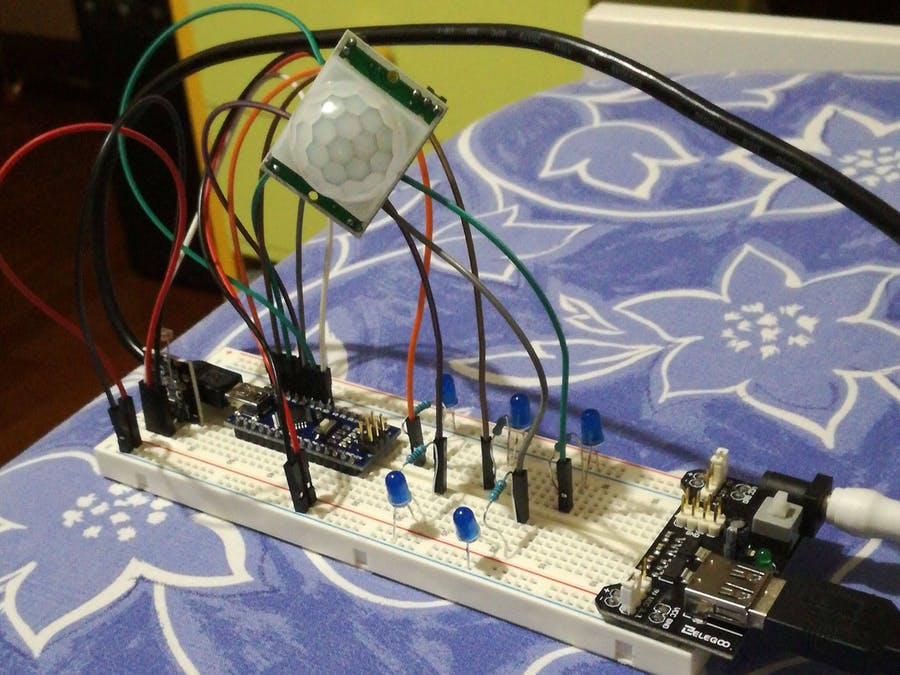
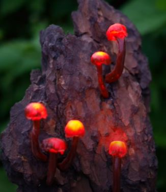
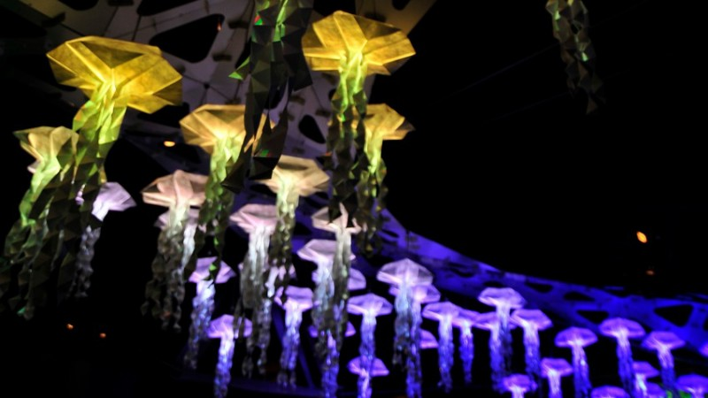
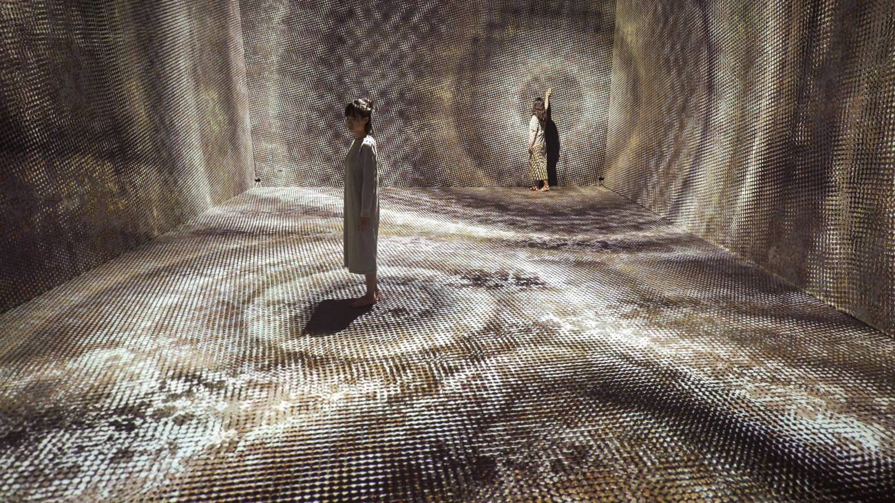
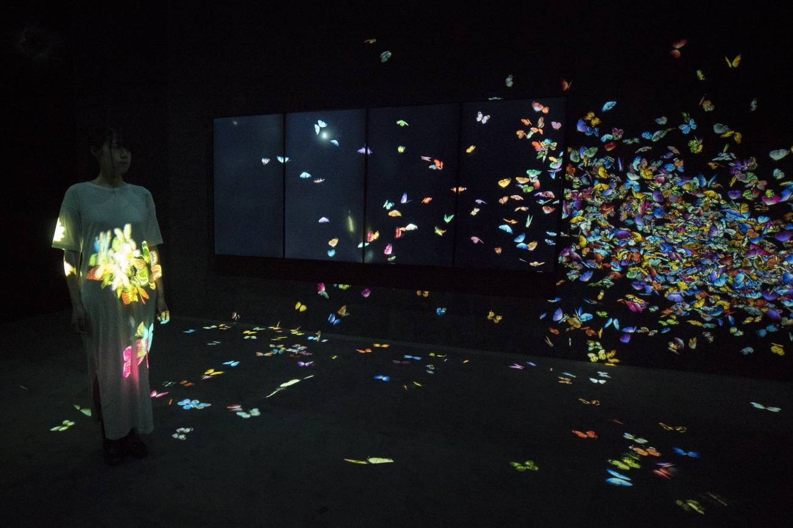
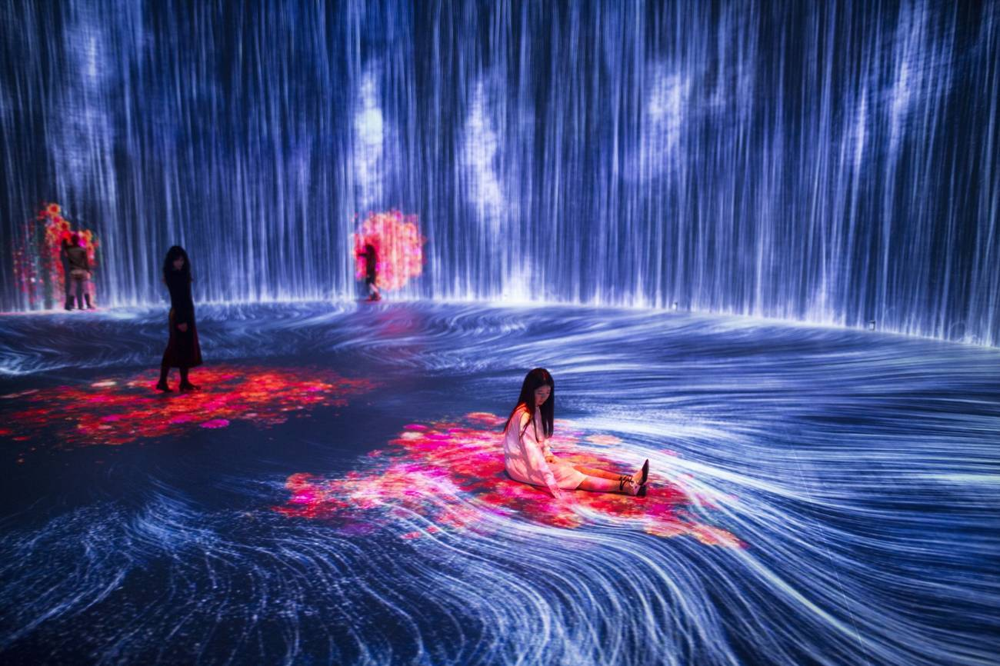
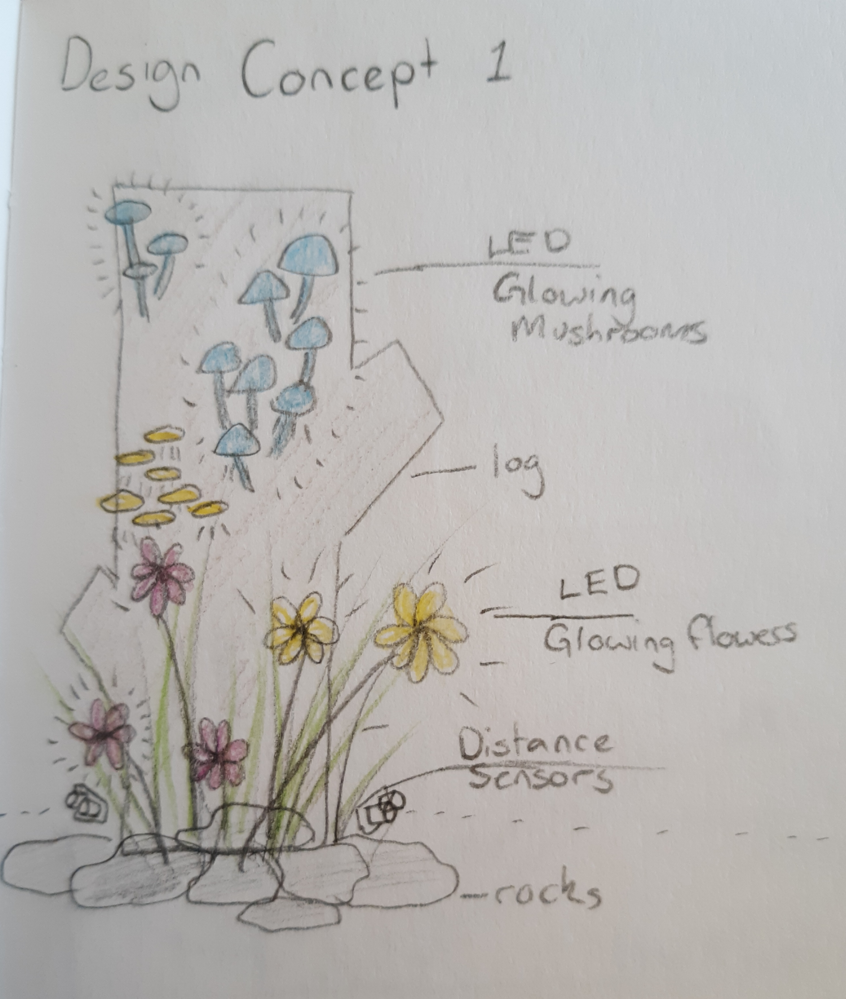
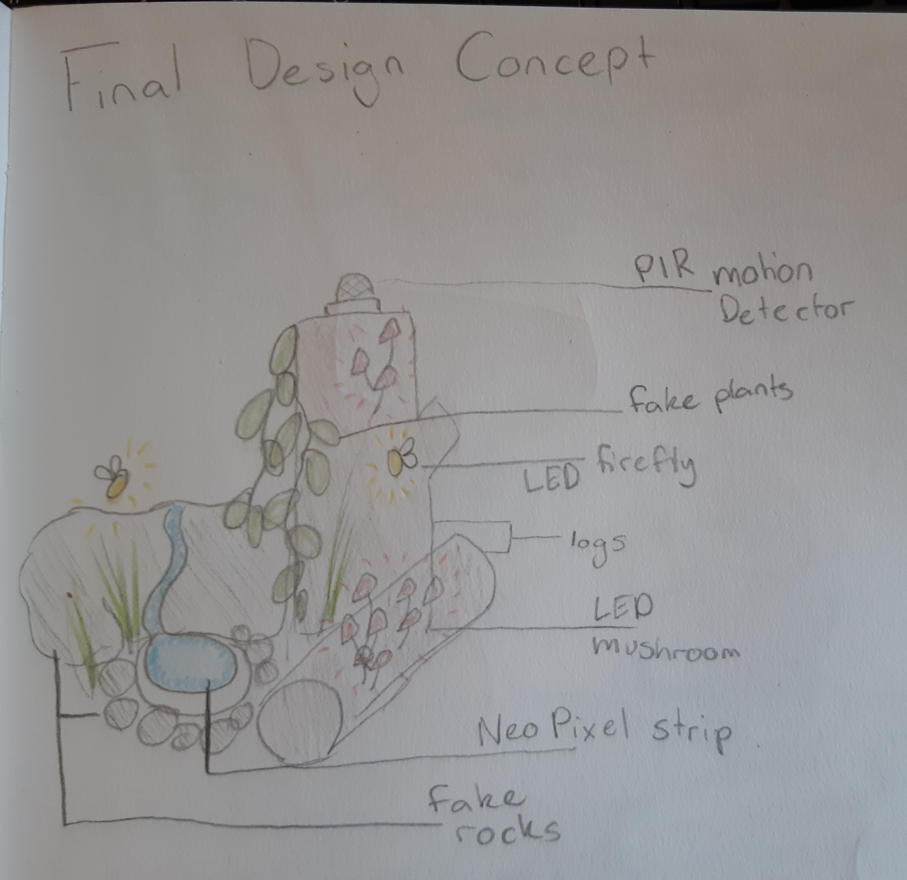

# 1701QCA Making Interaction - Assessment 2 workbook

You will use this workbook to keep track of your progress through the course and also as a process journal to document the making of your projects. The comments in italics throughout the template give suggestions about what to include. Feel free to delete those instructions when you have completed the sections.

When you have completed the template, submit the link to the GitHub Pages site for this repository as a link in Learning@Griffith. The link should be something like [https://qcainteractivemedia.github.io/1701QCA-Assessment2/](https://qcainteractivemedia.github.io/1701QCA-Assessment2/) where `qcainteractivemedia` is replaced with your GitHub username and `1701QCA-Assessment2` is replaced with whatever you called the repository this template is contained in when you set it up.

## Project working title ##
Still Life

## Related projects ##
*Find about 6 related projects to the project you choose. A project might be related through  function, technology, materials, fabrication, concept, or code. Don't forget to place an image of the related project in the appropriate folder and insert the filename in the appropriate places below. Copy the markdown block of code below for each project you are showing.*   
 
### Related project 1 ###   
Night Light Assisstant

  https://create.arduino.cc/projecthub/gabriele_fugazzi/night-light-assistant-0d9bf0?ref=tag&ref_id=motion%20sensor&offset=4
  

This project is related to mine because *insert reasons here*.

### Related project 2 ###   
Magical Mushrom Lights

https://www.youtube.com/watch?v=D5LjGFkpApw

This project is related to mine because *insert reasons here*.

### Related project 3 ###   
Jelly Swarm

https://www.tangibleinteraction.com/artworks/jelly-swarm

This project is related to mine because *insert reasons here*.

### Related project 4 ###   
People Create Space and Time, at the Confluence of their Spacetime New Space and Time is Born

https://www.teamlab.art/w/people_create_space/

This project is related to mine because *insert reasons here*.

### Related project 5 ###   
Play With Fire Over WIFI

https://create.arduino.cc/projecthub/electropeak/play-with-fire-over-wi-fi-esp8266-neopixels-android-app-26c4ad?ref=tag&ref_id=led%20strip&offset=5

This project is related to mine because *insert reasons here*.

### Related project 6 ###   
Flutter of Butterflies Beyond Borders, Ephemeral Life Born from People

https://www.teamlab.art/w/butterflies_ephemerallife_people/

This project is related to mine because *insert reasons here*.

### Related project 7 ###   
Universe of Water Particles in the Tank, Transcending Boundaries

https://www.teamlab.art/w/universe_of_water_particles_tank/

This project is related to mine because *insert reasons here*.

## Other research ##
*Include here any other relevant research you have done. This might include identifying readings, tutorials, videos, technical documents, or other resources that have been helpful. For each particular source, add a comment or two about why it is relevant or what you have taken from it.*     PIR thing,    Neo Pixel thing 
v
### *Brief resource name/description* ###

*Provide a link, reference, or whatever is required for somebody else to find the resource. Then provide a few comments about what you have drawn from the resource.*

## Conceptual progress ##

### Design intent ###
*Include your design intent here. It should be about a 10 word phrase/sentence.*  To create a small glowing environment to be used as a decorative or practical and calming sourse of light.

### Design concept 1 ###
*Outline three design concepts, each developed to a point where you anticipate it would be feasible to complete by the end of the course. Each should have a summary of the idea, a rough sketch of what it might be like, and any other notes you created while exploring the idea.*   
Design concept 1 is both a decorative and practical light that uses a distance sensor to activate the system of  glowing and moving  plant life.  The distance sensors would make different parts of the environment come on and get brighter as someone walks closer to it then slowly turn of as they get further away.  With the addition of a fan to make the plants move around like there was wind.  This could be both a novelty item or used as a night light to make a practical safety light in the dark.

With experimenting this idea I found the distance sensor as difficult to work however after a bit of reseach and trial and error I found that the sensor needed more power and after adding more power I got it to work with the LEDs and fan coming on at different times.

*Put the first two design concepts in the sections "Design concept 1" and "Design concept 2". Then put the third, with more development in the section "Final design concept".*

### Design concept 2 ###
*Put details here.*
The second concept is a large scale installation of a living environment that comes on and off with varying degrees of brightness when someone passes through it.  This would include glowing plant life, flowing water using LED strips, insects like fireflies and a fan to create movement and add to the realism.  Within the given time and technical ability for this project, the resulting experimental model could only be a small section of the overall concept.

I found basic instructions on how to make different effects with the Neo Pixel strips and had to do alot of testing to make it look like flowing water rather than just flashing lights.

### Final design concept ###
*This more fully developed concept should include consideration of the interaction scheme, technical functionality, fabrication approach, materials to be used, and aesthetic.* 
The final design concept is a small "living" environment consisting of the same glowing plant life, water, fireflies and fan.  This time however, using a PIR motion detector instead of a distance sensor, thereby making  a more realistic interaction between the person and environment.  By having the environment come to life when it senses no movement would replicate the real world wildlife where by, when movement is sensed the elements of the display "go into hiding".  By using the Microbit and the Pir Sensor, I would program the various elements of the display to come on (out of hiding) at different time intervals after no movement was detected, and go off again (into hiding) when there was movement.  

To create this project, I would begin by testing the various elements on the breadboard, before proceeding to incorporate them into my environment.  This I would create using actual wooden logs (rescued from the fire pit) and a fabricated "rock" made from papier-mache covered with air drying clay.  This would all be mounted on a base, painted and after the various elements were correctly wired(soldered) etc decorated with other plant life etc to complement the overall visual appeal of the project. For the mushrooms, I plan to mould them with silicon around the led, with the wiring continuing through the stem of the mushroom.  The fire flies, would be mounted using a yellow led decorated with celophane wings.  Flowers would be artificial flowers, with led's mounted in the centre, and wiring through the back of the flower and down the stem.

### Interaction flowchart ###
*Draw a draft flowchart of what you anticipate the interaction process in your project to be. Make sure you think about all the stages of interaction step-by-step. Also make sure that you consider actions a user might take that aren't what you intend in an ideal use case. Insert an image of it below. It might just be a photo of a hand-drawn sketch, not a carefully drawn digital diagram. It just needs to be legible.*

## Physical experimentation documentation ##

*In this section, show your progress including whichever of the following are appropriate for your project at this point.
a.	Technical development. Could be code screenshots, pictures of electronics and hardware testing, video of tests. 
b.	Fabrication. Physical models, rough prototypes, sketches, diagrams of form, material considerations, mood boards, etc.
Ensure you include comments about the choices you've made along the way.*

*You will probably have a range of images and screenshots. Any test videos should be uploaded to YouTube or other publicly accessible site and a link provided here.*

## Design process discussion ##
*Discuss your process in getting to this point, particularly with reference to aspects of the Double Diamond design methodology or other relevant design process.*

## Next steps ##
*Write a list or provide other information about your plan to move the project forward to be ready to present by video and documentation in week 12 of the course.*
